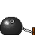

## About Me

I am a PhD candidate at Université de Lorraine, Nancy, France, under the supervision of <a href="https://sites.google.com/site/marianneclausel/home?authuser=0">Marianne Clausel</a>, <a href="https://perso.atilf.fr/mconstant/">Mathieu Constant</a> and <a href="https://xavieratcern.github.io/index.html">Xavier Coubez</a>. My research involves exploring the behavior of text data and language models and their interaction, focusing on the intersection of the medical domain and Natural Language Processing. 
Recently, I've been interested in the interaction between <a href="https://aclanthology.org/2024.bionlp-1.16.pdf">model performance</a>, <a href="https://aclanthology.org/2025.acl-long.269.pdf/">data perception variability</a>, and  <a href="https://actionable-interpretability.github.io/posters/159_simplicity_is_not_as_simple_as_you_think%20-%20Aman%20Sinha.pdf">interpretability</a>.

And more recently, I’ve developed a fondness for hallucinations in large language models. \
Here are some outcomes: <a href="https://chomps2025.github.io/">CHOMPS</a> , <a href="https://helsinki-nlp.github.io/shroom/2025a">SHROOM-CAP</a> 🦙👒 and <a href="https://helsinki-nlp.github.io/shroom/2025">Mu-SHROOM</a> 🍄

## Research Interests

- **Medical Language Understanding** 
- **Natural Language Processing**




